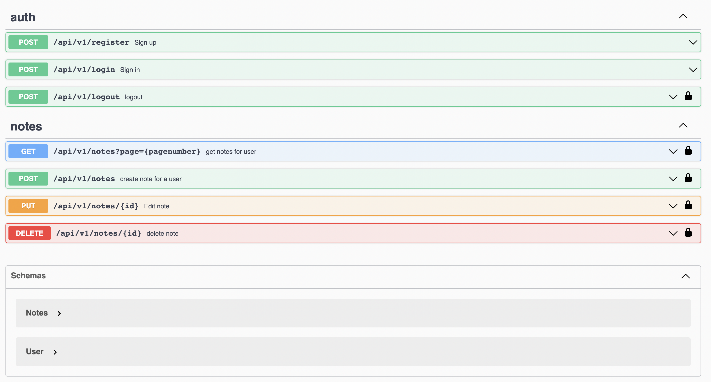

<p align="center"><a href="https://laravel.com" target="_blank"></a></p>

<!-- PROJECT SHIELDS -->

<!-- PROJECT LOGO -->
<br />
<p align="center">
  <h3 align="center">Note-app-backend</h3>

</p>


<!-- TABLE OF CONTENTS -->

  <summary><h2 style="display: inline-block">Table of Contents</h2></summary>
  <ol>
    <li>
      <a href="#about-the-project">About The Project</a>
      <ul>
        <li><a href="#built-with">Built With</a></li>
      </ul>
    </li>
    <li>
      <a href="#getting-started">Getting Started</a>
      <ul>
        <li><a href="#prerequisites">Prerequisites</a></li>
        <li><a href="#installation">Installation</a></li>
      </ul>
    </li>
    <li><a href="#usage">Usage</a></li>
    <li><a href="#roadmap">Roadmap</a></li>
    <li><a href="#license">License</a></li>
    <li><a href="#contact">Contact</a></li>
    <li><a href="#acknowledgements">Acknowledgements</a></li>
  </ol>


<!-- ABOUT THE PROJECT -->
## About The Project

 
 
A simple project which consists of backend API for a note app.


### Built With

* [Laravel](https://laravel.com/docs/8.x)
* [Swagger](https://swagger.io/)


<!-- GETTING STARTED -->
## Getting Started

To get a local copy up and running follow these simple steps.

### Prerequisites

  Install Docker Desktop :- [https://www.docker.com/products/docker-desktop](https://www.docker.com/products/docker-desktop)
   
### Installation

1. Clone the repo
   ```sh
   git clone https://github.com/abhey-sujith/note-app-laravel-api
   ```
2. Run command 
   ```sh
   ./vendor/bin/sail up
   ```
   
   Example local api in mac :- [http://localhost/api/v1/register](http://localhost/api/v1/register)
   
   Example api after deploying :- [https://note-app-laravel-api.herokuapp.com/api/v1/register](https://note-app-laravel-api.herokuapp.com/api/v1/register)
 
 ### Swagger Link
 
 
 
Live :- [https://note-app-laravel-api.herokuapp.com/api/documentation](https://note-app-laravel-api.herokuapp.com/api/documentation)
Localhost :- [http://localhost/api/documentation](http://localhost/api/documentation)


### Frontend App
React Native :- [https://github.com/abhey-sujith/note-app-react-native](https://github.com/abhey-sujith/note-app-react-native)


<!-- USAGE EXAMPLES -->
## Usage

### Auth

1) Register user 
2) Login user
3) Logout user

### notes CRUD

1) Get all notes
2) Create a note
3) Edit a note
4) delete a note

### Example Login API

 
 
<!-- ROADMAP -->
## Roadmap

✅ Setup project
✅ Create auth route
✅ Register
✅ Login
✅ Logout
✅ Create notes crud
✅ Get notes
✅ Create note
✅ Edit note
✅ Delete note
✅ Add swagger
✅ Deploy to Heroku
✅ Setup postgre server in heroku
✅ Test with postman

Improvements

☑️ Could add a feature to save images / voice . 

<!-- LICENSE -->
## License

Distributed under the MIT License. See `LICENSE` for more information.


<!-- CONTACT -->
## Contact

Abhey Sujith  - abheysujith@gmail.com

Project Link: [https://github.com/abhey-sujith/note-app-laravel-api](https://github.com/abhey-sujith/note-app-laravel-api)


<!-- ACKNOWLEDGEMENTS -->
## Acknowledgements

* https://www.youtube.com/watch?v=MT-GJQIY3EU&t=1554s
* https://www.youtube.com/watch?v=xvqPEEpRBJ4


